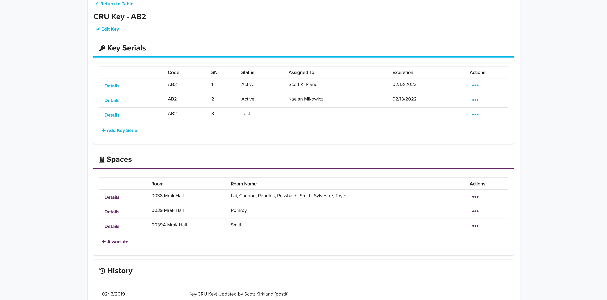
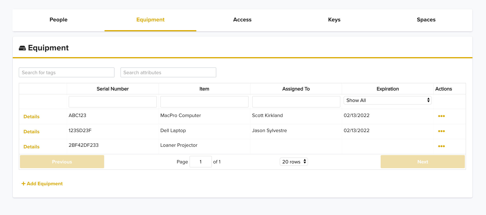
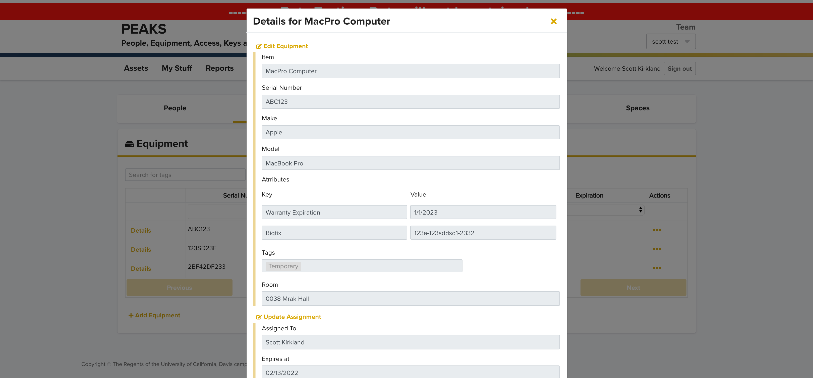
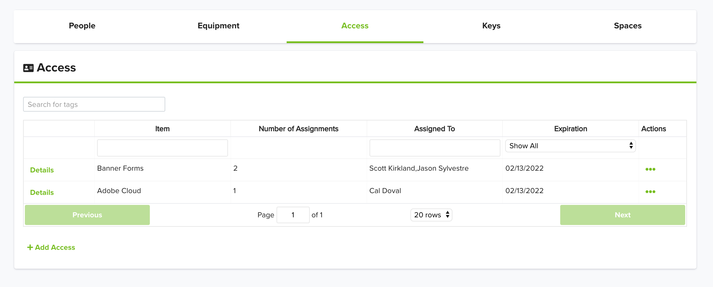
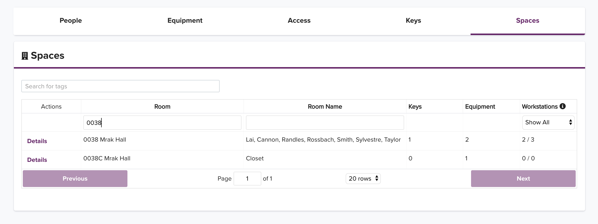
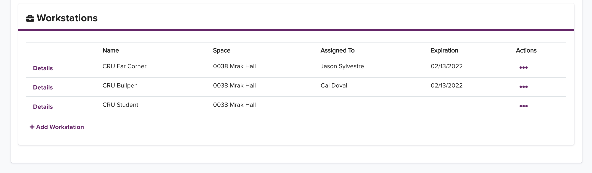
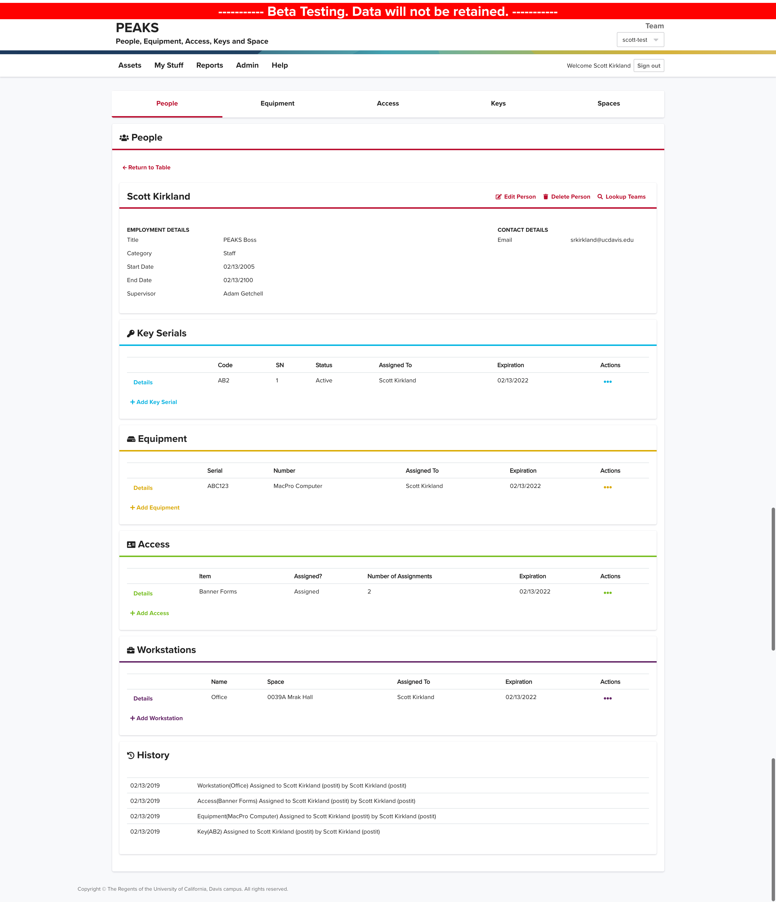

The goal of PEAKS is to provide a centralized system where teams can plan and track their most critical resources, enabling them to answer difficult questions like exactly which keys and computers are assigned to a specific person, when they acknowledged receipt of those items, what rooms they can access with those keys, and much, much more.

You can view the production site at https://peaks.ucdavis.edu/.  If you would like to get access to create your own team, continue to the bottom of this page and follow the instructions in the "I want it!!" section

# Features

## Overall

Every asset tracked in PEAKS features a full history, so you can see exactly when a computer was given to a specific employee, when they confirmed receipt of it, when it was transferred to someone else, and more.

Automatic email notifications will remind you to verify that a given asset is still appropriately assigned after an expiration timeline of your choosing.  For example, you may want to check in every 3 years to ensure staff members still require access to Banner student records.

## Key Tracking

Track the status of every key, including who it is assigned to and what rooms it can access.

## Equipment Tracking

Track all of your equipment -- anything from computers to printers to labelmakers to keycards.

For each equipment asset you can define custom attributes that can viewed and searched on later.  Maybe you'd like to keep the dell service tag or bigfix ID handy for your computers, or the model of your phones?

## Access Tracking

Access is unique because multiple people can be assigned to the same access entry.  Use it to keep track of who has access to your systems -- for example you can track everyone who uses Banner or Adobe Creative Cloud (or PEAKS!).

## Space & Workstation Tracking

Our integration with Facilities Link gives you a list of every space (roughly equivalent to a room) within your organization.  Each will give you details on what keys allow access to that space, what equipment should be in that space, and what workstations are in that space (and if those workstations are open or occupied).

## People Tracking

Track individual employees, faculty and students to determine which assets they have assigned, when each should expire, and also maintain additional person information like title, supervior, start/end dates, and more.  Your list of people can be synchronized based on Payroll department codes and/or entered manually.

# I want it!!

Well today is your lucky day.  Visit [our help ticketing system](https://caeshelp.ucdavis.edu/?appname=Peaks) and drop us a line.
